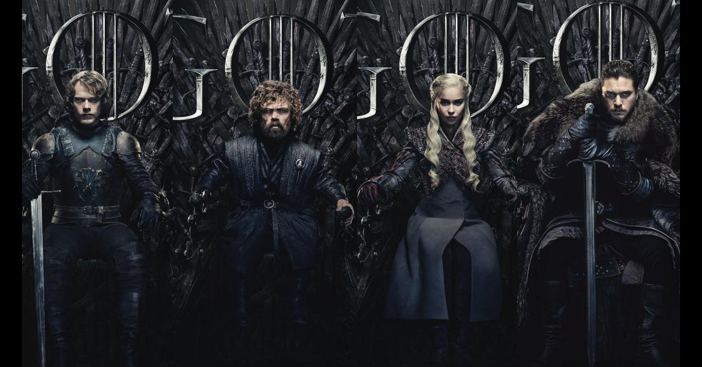
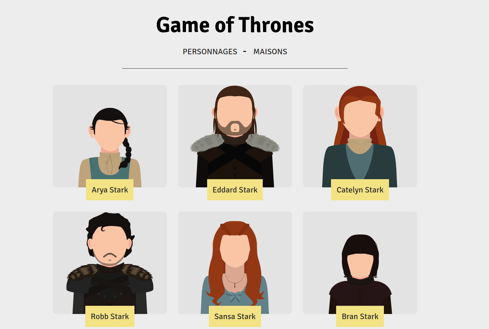

# Game Of Thrones

Un petit site de présentation de l'univers de Game Of Thrones avec les personnages, les biographies, les différentes maisons.

### Installation

Installez les dépendances à l'aide de composer via la commande suivante : ``composer install``

Créez votre base de données puis servez-vous du fichier d'export SQL fournit dans public/docs.

Créez un fichier ``.env`` (en faisant une copie du fichier ``.env.example``) puis configurez l'accès à votre base de données.

Enfin lancez le serveur laravel à l'aide de la commande suivante : ``php artisan serve``

Vous arriverez sur l'accueil du site où sont listés tous les personnages :

## Fabriqué avec

* Ce projet est codé avec les languages HTML5, CSS3 et PHP.
* J'ai utilisé le framework Laravel pour l'architecture du site. (https://laravel.com/) - Framework PHP

## Auteurs

* Morgane Alemany
